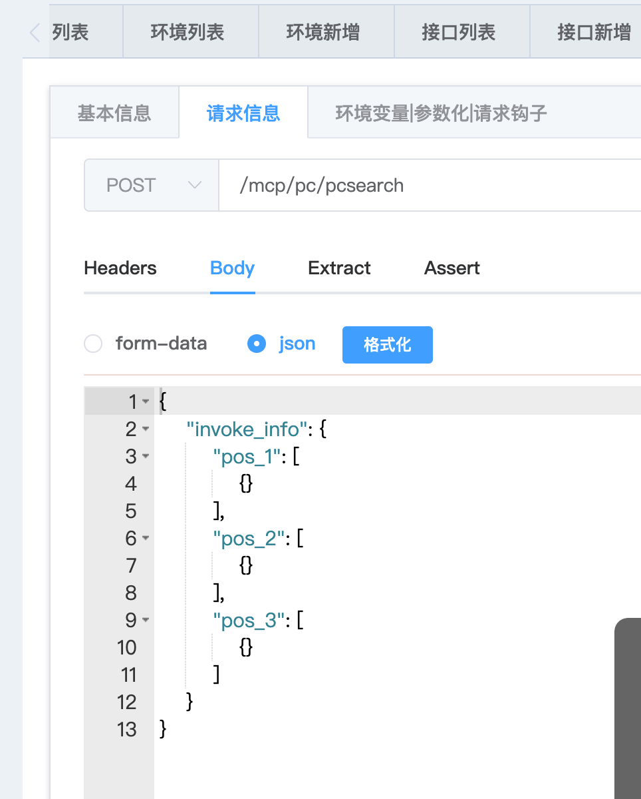

​
#一、项目介绍：
## 1.1 项目地址

后端地址：
https://github.com/18713341733/test_platform_service


前端地址：

https://github.com/18713341733/test_platform_front


## 1.2  项目介绍
### 1.2.1 环境准备
Python >= 3.8.0 (推荐3.9+版本)

nodejs >= 14.0 (推荐最新) 或者 16，千万不要使用18（会报错）

Mysql >= 5.7.0 (可选，默认数据库sqlite3，推荐8.0版本)

Redis(可选，最新版)

项目运行及部署 | Django-Vue-Admin

### 1.2.2 django-vue-admin 介绍（只做了解，不重要）
接口自动化平台，是基于 开源项目 Django-vue-admin 来写的。

Django-vue-admin 地址：

django-vue-admin: 基于RBAC模型的权限控制的一整套基础开发平台，前后端分离，后端采用 django+django-rest-framework，前端采用 vue+ElementUI。

 

# 二、前端项目 test_platform_front
## 2.1 项目启动
1、克隆项目

git clone https://github.com/18713341733/test_platform_front.git

 2、进入 test_platform_front 项目

cd test_platform_front

3、安装依赖

方式一：

npm install

方式二：

npm install --registry=https://registry.npm.taobao.org

方式三：

先安装cnpm

npm install -g cnpm --registry=https://registry.npm.taobao.org
再使用cnpm安装依赖

sudo cnpm install --registry=https://registry.npm.taobao.org


4、 启动服务

npm run dev

5、浏览器访问

http://localhost:8080

初始账号：superadmin 密码：admin123456

后端接口文档地址：http://127.0.0.1:8000/swagger

# 三、后端项目 test_platform_service
## 3.1 项目启动
1、克隆项目

git clone https://github.com/18713341733/test_platform_service.git
 2、进入test_platform_service 项目

cd test_platform_service

3、安装依赖

pip install -r requirements.txt

4、配置mysql

在conf/env.py 中，配置mysql连接信息

3、在 env.py 中配置数据库信息 

```commandline
# 使用mysql时，改为此配置
DATABASE_ENGINE = "django.db.backends.mysql"
DATABASE_NAME = 'backend' # mysql 时使用
 
# 数据库地址 改为自己数据库地址
DATABASE_HOST = "127.0.0.1"
# # 数据库端口
DATABASE_PORT = 3306
# # 数据库用户名
DATABASE_USER = "root"
# # 数据库密码
DATABASE_PASSWORD = "123456"

```

5、创建mysql数据库

需要手动在mysql中，创建名为backend的数据库

mysql数据库版本建议：8.0 mysql数据库字符集：utf8mb4
在mysql中，创建名为backend的库
```commandline
CREATE DATABASE backend charset=utf8mb4;
```


6、生成迁移脚本

```commandline
python3 manage.py makemigrations
```


7、执行迁移 

```commandline
python3 manage.py migrate
```


8、执行 初始化数据 

```commandline
python3 manage.py init
```


9、启动项目 

python3 manage.py runserver 127.0.0.1:8000


或者：

python3 manage.py runserver 0.0.0.0:8000


初始账号：superadmin 密码：admin123456

后端接口文档地址：http://127.0.0.1:8000/swagger

# 四、前后端联调
## 4. 1 修改前端监听后端服务的地址
### 4.1.1 启动后端项目
```commandline
python3 manage.py runserver 0.0.0.0:8000
```


启动项目后，查一下后端的ip地址 

### 4.1.2 启动前端项目

1、修改前端项目监听的后端地址


 

将两个文件： .env.development 与.env.test 中的监听地址，改成真实的后端地址

```commandline
# 后端接口地址及端口(域名)
VUE_APP_API = "http://192.168.43.224:8000"
```

 
2、启动项目：

```commandline
npm run serve
```


http://192.168.43.224:8080/

登录前端页面

初始账号：superadmin 密码：admin123456

后台手册 | Django-Vue-Admin

## 4.2 配置左侧菜单栏
### 4.2.1 项目初始菜单配置
在dvadmin/system/fixtures/init_menu.json 中，配置初始菜单。

```commandline
 {
                "name": "部门管理",
                "icon": "bank",
                "sort": 3,
                "is_link": false,
                "is_catalog": false,
                "web_path": "/dept",
                "component": "system/dept/index",
                "component_name": "dept",
                "status": true,
                "cache": false,
                "visible": true,
                "parent": 277,
                "children": [],
                "menu_button": [
```

is_link：如果不是外部的连接，就填写 false

is_catalog: 是否是目录

web_path: 当前页面的uri地址。

 "component": "system/dept/index" 前端组件的地址

component_name： 前端组件名称

### 4.2.2 配置菜单举例
TODO

## 4.3 后端项目结构介绍


###  4.3.1  apps
apps 存放的是接口自动化所需要的app。

包括：

项目模型

接口模型

用例模型

配置模型

套件模型

内置函数模型

环境变量模型

测试报告模型

用户模型


###  4.3.2 conf
项目配置地址conf

### 4.3.3. reports
测试报告地址reports

### 4.3.4 utils
接口自动化所需要的工具

## 4.3 前端项目结构介绍


###  4.3.1 接口自动化前端组件
/test_platform_front/src/views/apitest

### 4.3.2 接口自动化路由
/test_platform_front/src/apitestapi

# 五、编写接口自动化case
接口自动化底层驱动，是基于httprunner 1 实现的。

如编写一个百度的接口请求。


 

https://ug.baidu.com/mcp/pc/pcsearch

POST

body: {"invoke_info":{"pos_1":[{}],"pos_2":[{}],"pos_3":[{}]}}

header: 

Content-Type:application/json

1、创建项目

接口自动化-项目管理-项目新增


 2、配置base url

环境管理-环境新增

这里只需要填写接口的host就可以。


 3、新增接口

接口管理-接口新增


 4、配置管理--配置新增

在这里可以编写统一的header，如

Content-Type:application/json


 

 5、编写case

新增case


 编写body 



编写断言：


点击保存

5、运行case

 用例管理--用例列表


6、测试报告 


 

 

六、其他相关资料
Django实现接口自动化平台（七）数据库设计_做测试的喵酱的博客-CSDN博客

Django实现接口自动化平台（五）httprunner（2.x）基本使用【持续更新中】_做测试的喵酱的博客-CSDN博客

三、django-vue-admin开源项目二次开发——后端快速实现curd及接口_做测试的喵酱的博客-CSDN博客

二、django-vue-admin开源项目二次开发——修改默认菜单_做测试的喵酱的博客-CSDN博客

​